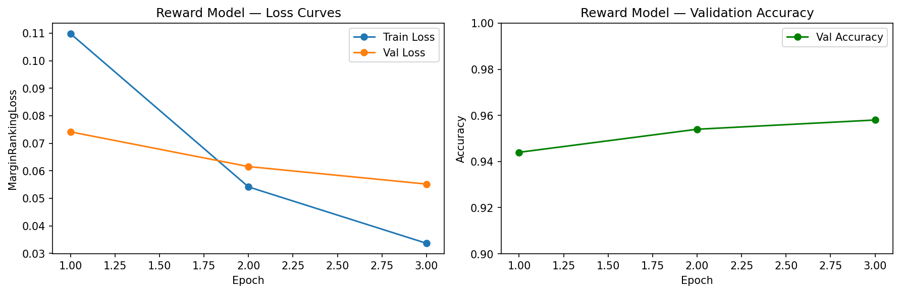
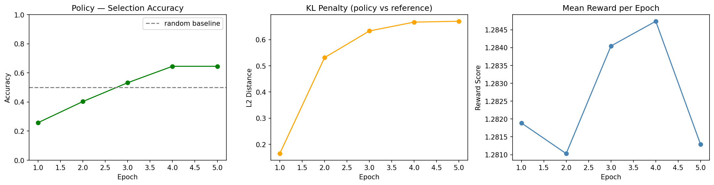
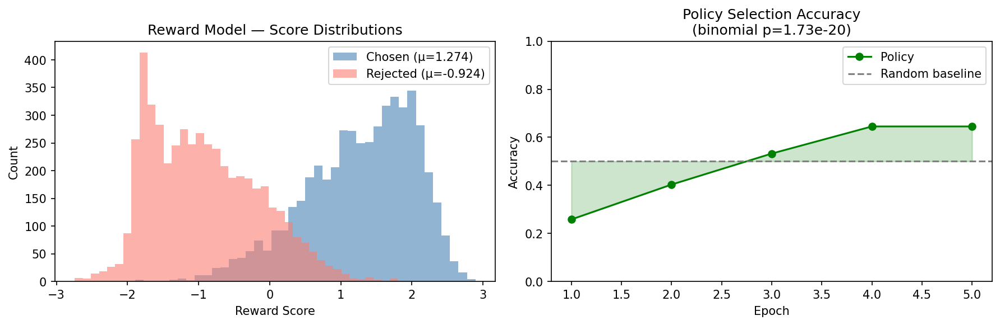
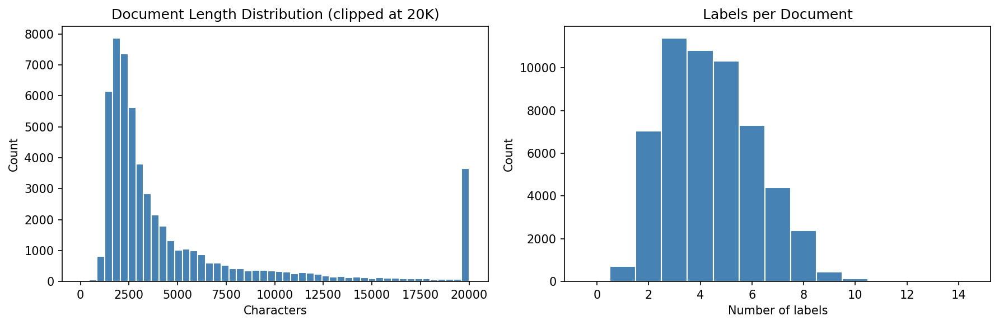
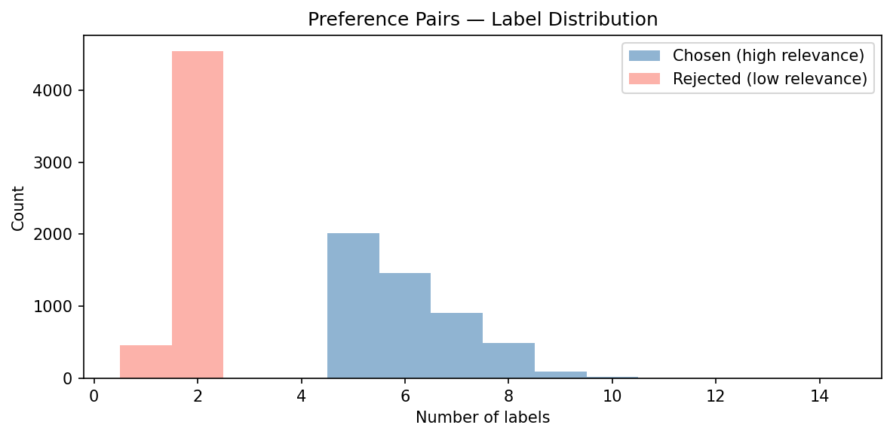

# Legal RLHF — Reward Modeling and GRPO for Legal Document Relevance

End-to-end RLHF pipeline applied to legal document relevance ranking,
using the EURLEX dataset from lex_glue (55,000 EU legal documents).

Motivated by prior work showing that supervised fine-tuning with limited
labeled data collapses to constant outputs — demonstrated in the
[pain-llm-finetuning](https://github.com/KelyNorel/pain-llm-finetuning) project.
RLHF with preference pairs provides a more robust training signal —
relative preferences are easier to learn than absolute scores.

## Overview

Motivated by prior work showing that supervised fine-tuning with limited
labeled data collapses to constant outputs — demonstrated in the
[pain-llm-finetuning](https://github.com/KelyNorel/pain-llm-finetuning) project.
RLHF with preference pairs provides a more robust training signal —
relative preferences are easier to learn than absolute scores.

This project implements a two-stage RLHF pipeline:

1. **Reward Model** — DistilBERT fine-tuned on preference pairs (chosen vs rejected documents). Achieves 98.7% pairwise accuracy.
2. **GRPO Policy** — policy model optimized via Group Relative Policy Optimization using the reward model as signal. Selection accuracy improves from 25% → 64.5% over 5 epochs (binomial p=1.73e-20).


## Algorithm: GRPO vs PPO

This project uses **GRPO (Group Relative Policy Optimization)** — the algorithm
used in DeepSeek-R1 — rather than classic PPO.

| | PPO | GRPO |
|---|---|---|
| Value model | Required (separate model) | Not needed |
| Advantage estimate | vs learned value function | vs group mean reward |
| Memory | Higher | Lower |
| Complexity | Higher | Lower |

GRPO normalizes rewards within each batch (group relative):

```
advantage = (reward - batch_mean) / batch_std
```
No separate value model needed — more efficient and simpler to implement.

## Results

| Metric | Value |
|---|---|
| Reward model pairwise accuracy | 98.7% |
| Reward model t-test | t=143.4, p < 2.2e-16 |
| Policy final selection accuracy | 64.5% |
| Policy binomial test vs random | p=1.73e-20 |

## LLM-as-a-Judge Validation

To validate the n_labels proxy, Claude (claude-sonnet-4-5) evaluated 100 preference 
pairs independently, assessing which document would be more useful to a legal 
professional researching EU regulations.

| Verdict | Count | % |
|---|---|---|
| Agrees with n_labels (A) | 51 | 51% |
| TIE | 34 | 34% |
| Disagrees with n_labels (B) | 15 | 15% |

**Finding:** n_labels agreement at 51% is statistically indistinguishable from chance,
confirming it is a weak proxy for legal relevance. Claude identifies qualitative 
differences — conceptual depth, cross-framework applicability, fundamental vs. 
administrative content — that n_labels misses entirely.

**Production implication:** Replacing n_labels with LLM-as-a-Judge preferences would 
generate higher-quality training data, likely improving GRPO policy performance 
beyond the current 64.5% selection accuracy.

### Training Curves





### Evaluation



## Dataset

**Source:** [lex_glue / eurlex](https://huggingface.co/datasets/lex_glue)  
**Documents:** 55,000 EU legal texts with multi-label legal category annotations  
**Preference pairs:** 5,000 (chosen: ≥5 labels, rejected: ≤2 labels)  

### Preference Pair Construction





## Design Decisions

**Excluding middle-label documents:** Documents with 3–4 labels (~22K) are
excluded from preference pairs. Using only clear high/low examples (≥5 vs ≤2)
maximizes signal clarity for reward model training — ambiguous middle cases
would introduce noise in preference labels.

**Truncation at 2,048 characters:** For a reward model learning relative
preferences, the header and opening context are sufficient signal. Chunking
would complicate preference pair construction without clear benefit for this task.

**SFT step omitted:** Reward model initialized directly from pre-trained
DistilBERT. In production, SFT on domain-specific data would precede
reward model training.

**Distant supervision via n_labels:** In production RLHF, preference pairs
come from human annotators or LLM-as-a-Judge. Here we use n_labels as a
proxy — documents with more legal category labels are more topically specific.
Known limitation: topical specificity ≠ true legal relevance.

**KL penalty as L2 distance:** DistilBERT with a single scalar output does
not produce a proper probability distribution, making true KL divergence
undefined. L2 distance between policy and reference logits serves the same
purpose: penalizing drift from the reference model and preventing reward hacking.

**Reproducibility note:** shuffle uses random state at runtime — results
vary slightly between runs. The learning trend (monotonic increase in
selection accuracy) is consistent across runs; absolute epoch-1 values vary.

**TIE handling:** 34% of LLM-as-a-Judge evaluations resulted in TIE verdicts. 
In production, recommended strategy is to discard TIE pairs, preserving only 
high-confidence preferences for reward model training.

## Limitations and Production Path

This project demonstrates the RLHF pipeline at small scale. In production:

- **Preference signal:** human annotators or LLM-as-a-Judge instead of n_labels proxy
- **Base model:** larger model (LLaMA, Mistral) for richer document representations
- **Scale:** 50K+ preference pairs, 10-20 epochs
- **Evaluation:** held-out test set with human relevance judgments

Expected production performance: 75-85% selection accuracy with above improvements.

## Connection to Prior Work

Supervised fine-tuning with n=67 labeled examples collapses to constant
outputs regardless of architecture or hyperparameter tuning — demonstrated
in [pain-llm-finetuning](https://github.com/KelyNorel/pain-llm-finetuning).
RLHF addresses this directly — relative preference signals are more robust
than absolute labels with limited data, consistent with findings in
low-resource NLP settings.

## Stack

- Python, pandas — data processing
- HuggingFace datasets, transformers — model and data loading
- PyTorch — reward model and GRPO training
- scipy — statistical validation (t-test, binomial test)
- Matplotlib — visualizations
- Jupyter — EDA notebook

## Project Structure
```
legal-rlhf/
├── data/                        # not tracked in git
│   ├── preference_pairs.csv     # 5,000 preference pairs
│   ├── reward_model.pt          # trained reward model weights
│   ├── policy_model.pt          # trained policy model weights
│   ├── reward_model_metrics.json
│   └── grpo_metrics.json
├── figures/
│   ├── 00_eda_distributions.png
│   ├── 01_preference_pairs.png
│   ├── 02_reward_model_training.png
│   ├── 03_grpo_training.png
│   └── 04_evaluation.png
├── notebooks/
│   └── 00_eda.ipynb                # data exploration and pair construction
│   └── 01_llm_judge.ipynb           # LLM-as-a-Judge validation of n_labels proxy
├── src/
│   ├── reward_model.py          # reward model architecture and training
│   ├── plot_metrics.py          # reward model training curves
│   ├── grpo.py                  # GRPO policy optimization
│   ├── plot_grpo.py             # GRPO training curves
│   └── eval.py                  # statistical evaluation
├── .gitignore
├── requirements.txt
└── README.md
```
## Setup

```bash
pyenv virtualenv 3.11 legal-rlhf
pyenv local legal-rlhf
pip install -r requirements.txt
```

### Run the pipeline

```bash
# 1. EDA and preference pair construction
jupyter notebook notebooks/00_eda.ipynb

# 2. Train reward model
python src/reward_model.py

# 3. Train policy with GRPO
python src/grpo.py

# 4. Evaluate
python src/eval.py
```

---

**Author:** Raquel (Kely) Norel, PhD  
**Domain:** Legal AI / RLHF  
**Status:** ✅ Complete

